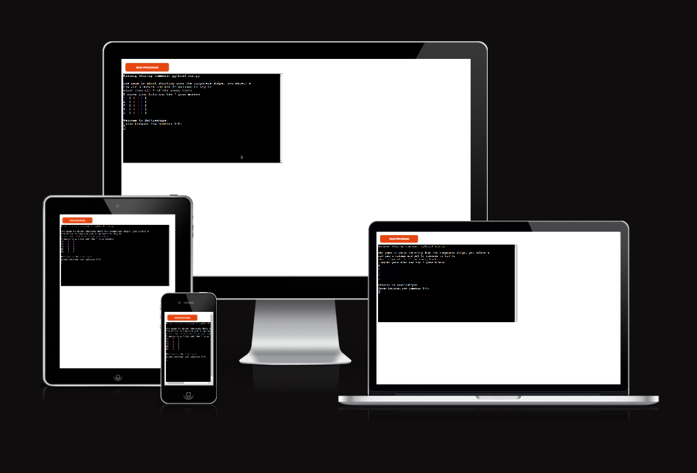
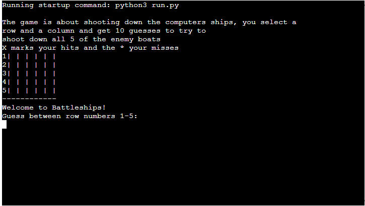

# Last Battleship

Last Battleship is a Python terminal game where users can challenge the computer
by destroying all their ships in 10 guesses. 

## How to play

Last Battlship is based on the original battleship game but with some diffrences.

In this version a guessing board, showing your guesses is generated for the user and another hidden one is created for the computer. 

You have 10 guesses to shoot down all of the enemy ships and after your game will end.  

If you hit all 5 ships it will print that you won the game and the game will end. 

Misses are marked with * and hits with X 

## Features
- Random board generation
    - Ships are randomly generated on the hidden computer board
    - Guess board generated to show your guesses 
- Rules 
    - Game rules will be printed out on the terminal
- Play against the computer
- Accepts user inputs
- Count guesses and show how many are left 
- Input validation and error-checking
    - Cannot input number larger than 5
    - Must input a number 
    - Can not enter same guess twice  
- Future Features
    - Make another board user and let computer guess user ship location 
    - User can choose themselves where they want the ships to be 
    
## Running Tests
- Passed the code through PEP8 linter and only problem is trailing whitespace
- Given invalid inputs: same input twice, a string when numbers is expected, out of bounds input 
- Tested in local terminal and the Code Institute Heroku terminal

## Bugs
- My if statment on line 95 that 

